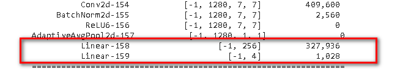
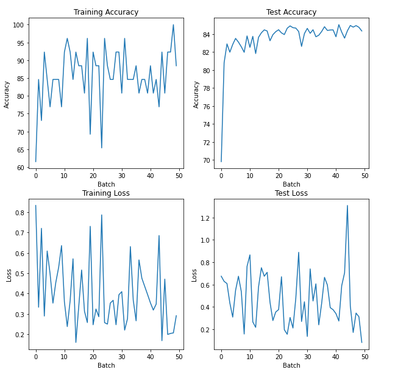

Following is the Pytorch based implementation to use pretrained Mobilenetv2 model and train it over four classes namely Flying Birds, Winged_drones, Large Quadcopters, Small Quadcopters. The images for these labels can be found out at
https://drive.google.com/file/d/133nsp1_PJXUpKOLzcYu9JivzHlGKMr8x/view?usp=sharing

We added following two fully connected model on top of existing pretrained model. 
# Mobilenet Model Addition to suit new class addition

Main colab file is kept at

New Generated model is kept at 

Training/Testing medhod is kept at

Image Augmentation and data loading is kept at

The model has been trained over 50 epochs and we are able to achive 85% as top test accuracy.
# Plots

# LR vs Epochs

# Misclassified Images
1. Flying Birds

2. Large Quadcopters

3. Small Quadcopters

4.Winged Drone

# Cloud Watch Logs

# Api Gateway

