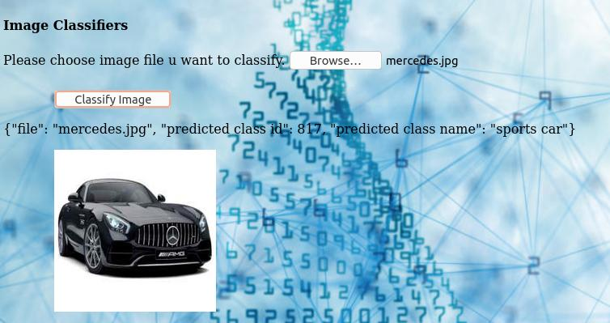

## EVA 4 Phase 2 Assignment 3 Deploy Face Alignment and Face Swap apps on AWS
------------------------------------------------------------------------------------------------------------

## Group : 
1. Abhijit Mali
2. Gunjan Deotale
3. Sanket Maheshwari
4. Pratik Jain

----------------------
## Notes 
---------------------------------------------------------------------------------------------------------------------------
## Following examples are implemented as AWS apps:
1. Resnet image classification
2. Mobilenet flying object classification
3. Face Alignment
4. Face Swap

Link : https://session3--face-alignment-face-swap.s3.ap-south-1.amazonaws.com/doctype.html

----------------------------------------------------------------------------------------------------------------------------
## Results on webpage for different APIs:

1. Resnet image classification

